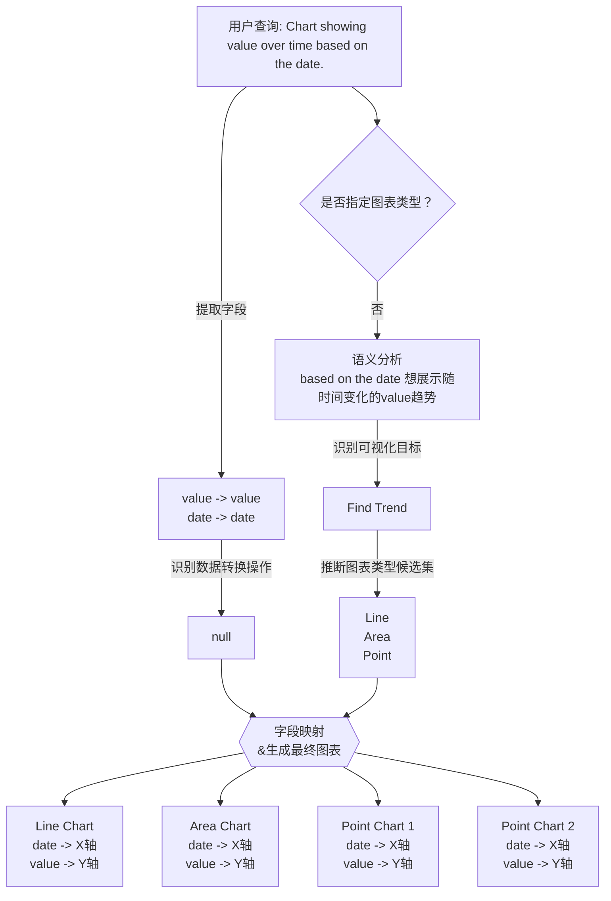

```mermaid
flowchart TD
    A["用户查询: Chart showing value over time based on the date."] -- 提取字段 --> Field["value -> value<br>date -> date"]
    A --> Vis["是否指定图表类型？"]

    Vis -- 否 --> SemanticAnalysis["语义分析<br>based on the date 想展示随时间变化的value趋势"]
    SemanticAnalysis --识别可视化目标--> Goal2["Find Trend"] 
    Goal2 -- 推断图表类型候选集 --> ChartType["Line<br>Area<br>Point"]

    Field -- 识别数据转换操作 --> Transform["null"]
    Transform --> Output["字段映射<br>&生成最终图表"]

    ChartType --> Output
    Output --> K1["Line Chart<br>date -> X轴<br>value -> Y轴"] 
    Output --> K2["Area Chart<br>date -> X轴<br>value -> Y轴"] 
    Output --> K3["Point Chart 1<br>date -> X轴<br>value -> Y轴"] 
    Output --> K4["Point Chart 2<br>date -> X轴<br>value -> Y轴"]

    Vis@{ shape: diam}
    Output@{ shape: hex}
```