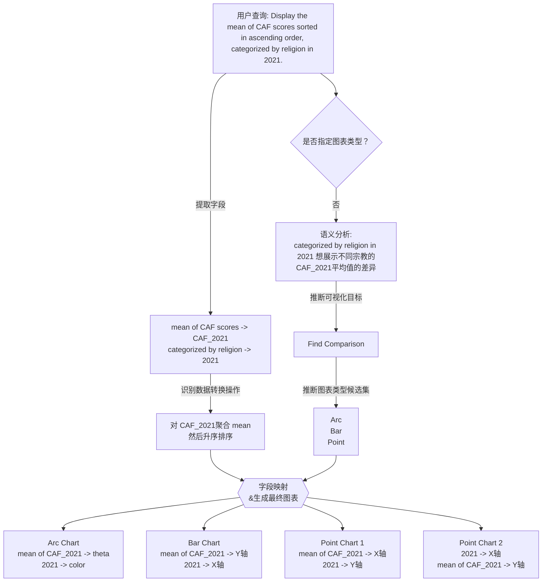

```mermaid
flowchart TD
    NL["用户查询: Display the mean of CAF scores sorted in ascending order, categorized by religion in 2021."] -- 提取字段 --> Field["mean of CAF scores -> CAF_2021<br>categorized by religion -> 2021"]
    NL --> Vis["是否指定图表类型？"]

    Vis -- 否 --> SemanticAnalysis["语义分析:<br>categorized by religion in 2021 想展示不同宗教的CAF_2021平均值的差异"]
    SemanticAnalysis --推断可视化目标--> Goal2["Find Comparison"] 
    Goal2 -- 推断图表类型候选集 --> ChartType["Arc<br>Bar<br>Point"]

    Field -- 识别数据转换操作 --> Transform["对 CAF_2021聚合 mean<br>然后升序排序"]
    Transform --> Output["字段映射<br>&生成最终图表"]

    ChartType --> Output
    Output --> K1["Arc Chart<br>mean of CAF_2021 -> theta<br>2021 -> color"] 
    Output --> K2["Bar Chart<br>mean of CAF_2021 -> Y轴<br>2021 -> X轴"] 
    Output --> K3["Point Chart 1<br>mean of CAF_2021 -> X轴<br>2021 -> Y轴"] 
    Output --> K4["Point Chart 2<br>2021 -> X轴<br>mean of CAF_2021 -> Y轴"]

    Vis@{ shape: diam}
    Output@{ shape: hex}

```